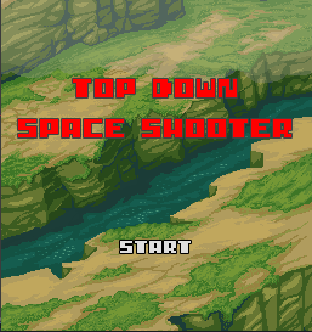
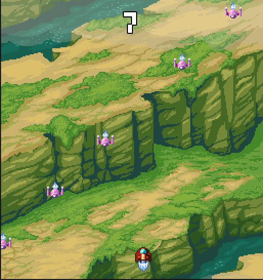

# Top-Down-Space-Shooter



Juego de ejemplo de un "tow down space shooter"

# Descripción
Las partes del juego estan desarrolladas en las siguiente esctructura:
```
escenes/
    ├── 01_player/
    ├── 02_brackground/
    ├── 03_enemy/
    ├── 04_laser_n_explosion/
    ├── 05_collision_n_signals/
    ├── 06_music/
    ├── 07_ui_titles/
```

# Jugar:
* Prueba este juego en el suiguiente [enlace](https://andrestapa.itch.io/top-down-shooter-tutorial).
